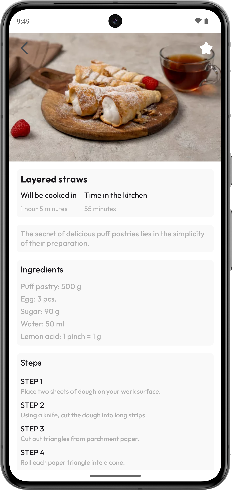

# Recipes

---

## Demo APK

Make sure you have enabled the <strong>"Install apps from unknown sources"</strong> option in your phone settings.

## Content
- [About App](#about-app)
- [Screenshots](#screenshots)
- [Technologies](#technologies)
- [Setup](#setup)

### About App

**Recipes** is one of my top 10 favorite projects to show off my skills and build a good portfolio. This app helps the
user browse a list of recipes, save them to favorites, and view instructions on how to cook them.

In this project, I used MVVM and Clean Architecture, which helped me separate the logic and make it easier to extend the
functionality.  I also use the Room library as a database, Flow for reactive data processing, and Picasso for loading
images.

### Screenshots

    
    

---

### Technologies

* Language: **Kotlin**
* Architecture: **MVVM, Clean Architecture**
* Libraries: **Picasso, Room, Gson, Flow**

### Setup

1. Clone the repository: `git clone https://github.com/muratov-dev/RecipesProject.git`
2. Open the project in Android Studio and sync with Gradle.
3. To build and run, click **Run** or build the APK via **Build > Build APK(s)**.
